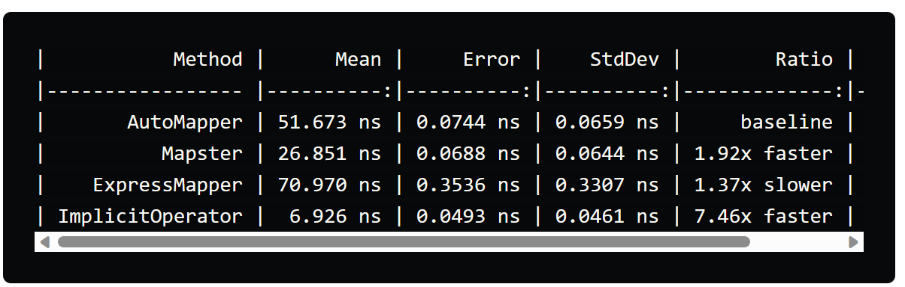

# minimal-api-labs

#### Object Mapping
- Automapper
- Mapster
- ExpressMapper
- Implicit Operator

_e.g using implicit operator_
```csharp
public class Person
{
    public int Id { get; set; }
    public string FirstName { get; set; }
    public string LastName { get; set; }
    public DateTime Birthday { get; set; }
}

public class PersonDto
{
    public int Id { get; set; }
    public string FirstName { get; set; }
    public string LastName { get; set; }
    public DateTime Birthday { get; set; }

    public static implicit operator PersonDto(Person person)
    {
        return new PersonDto
        {
            Id = person.Id,
            FirstName = person.FirstName,
            LastName = person.LastName,
            Birthday = person.Birthday
        };
    }
}
```
benchmarks:



